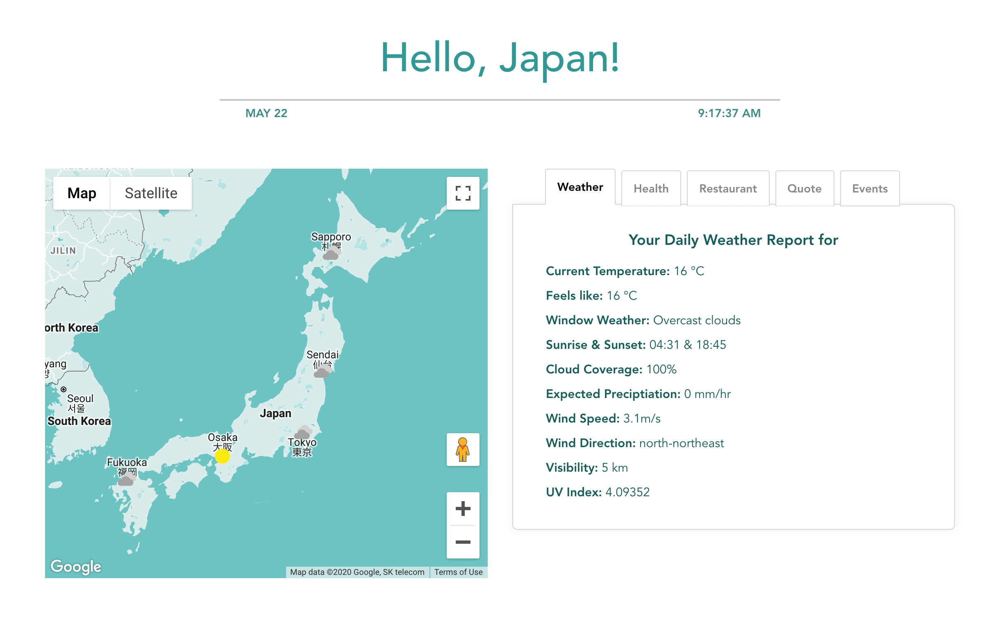
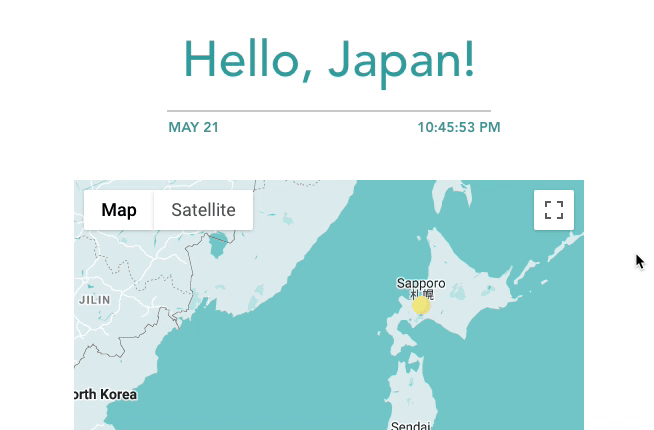

# **Hello Japan** 🇯🇵
###### This was made during our time as students at Code Chrysalis



### Checkout our app, it's been deployed! 👉 [**Hello Japan**](https://hellojapanapp-cc.herokuapp.com/) 👈

## **👋 A Little Introduction**

Hello Japan, is a one-stop dashboard to start your day smoothly!

I'm sure you've had those mornings where you're bombarded with a chaos of data 🌪 The information we want delivered to us, from news and weather to daily memes, is scattered across different apps! So we find ourselves opening and closing multiple apps just to get that little piece of information... 

Now, wouldn't it be nice 🎶 if we could just open up **one** dashboard that displayed **all** the information we needed? Yeah, we thought so too! And that's why we created this app, so you can surf the waves smoothly and simply 🌱


**By the way, it looks just as beautiful on mobile! So check it out on your phone too! 👍**




## **🚀 Steps to Setting Up!**
**1.** Begin by installing the dependencies we used! 
```
 yarn install
```
**2.** Get your API key 🔑 from [Rakuten Rapid](https://api.rakuten.co.jp/en/) API and [Google Maps](https://developers.google.com/maps/documentation/javascript/get-api-key)

**3.** Create a `.env` file and store your API keys there:
```
 VUE_APP_GAPIKEY=[Your Google API Key goes here!]
 VUE_APP_RAPIKEY=[Your Rakuten Rapid API Key goes here!]
```
**4.** Now that you're all set, run the server and enjoy! 🎉
```
 yarn serve
```

## **✏️ Authors**
- [Riku Kawano](https://github.com/rikukawano)
- [Polly Sutcliffe](https://github.com/pollyj)
- [Chip Crawford](https://github.com/cwcraw)
- [Yuya Harada](https://github.com/yuya-h-29)
- [Zowie Min](https://github.com/Zowie0122)

###### Made with ♥️ by rapidPotato
